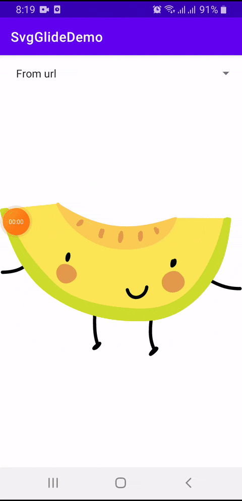

# SvgGlide

svgglide Module for loading SVG in Glide 4, based on [AndroidSVG](http://bigbadaboom.github.io/androidsvg/) library and [SvgImageLoaderPlugins](https://github.com/kirich1409/SvgGlidePlugins). During loading, SVG will converted into Drawable.
Output image will scale up or down, without becoming blurry.

It requires Android SDK 19+ and load SVG from url, assets folder, raw folder and hardcoded string.

Don't forget to create AppGlideModule like described [here](http://bumptech.github.io/glide/doc/generatedapi.html).

```kotlin
@GlideModule
class MyAppGlideModule : AppGlideModule {
    // No configuration required for svgglide module
}
```


